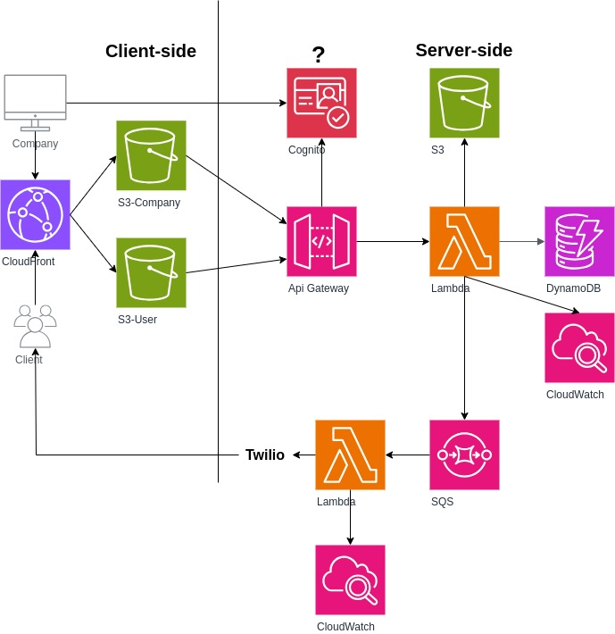

# Implantação na AWS



## Requisitos
- AWS CLI
- ZIP
- Linux

## Descrição
- Acesse o diretório `proxy-function` pela linha de comando e execute os seguintes comandos:
```bash
npm i --omit=dev && \
zip -r proxy-function.zip . && \
mv proxy-function.zip ../infra/
```

- Acesse o diretório `sms-notification-function` e execute os seguintes comandos:
```bash
npm i --omit=dev && \ 
zip -r sms-notification-function.zip . && \
mv sms-notification-function.zip ../infra/
```

- Crie um bucket com qualquer nome no serviço S3 para hospedar os arquivos necessários para a implantação.

- Faça o upload dos arquivos do diretório `infra` no bucket criado anteriormente. É importante que os arquivos fiquem na raiz do bucket.

- Faça login na AWS pela CLI e execute o comando abaixo substituindo `YOUR_BUCKET_NAME` pelo nome do seu bucket criado anteriormente:
```bash
aws cloudformation create-stack --stack-name wiyo --template-url https://YOUR_BUCKET_NAME.s3.amazonaws.com/Root.yaml --parameters ParameterKey=StackBucketName,ParameterValue=YOUR_BUCKET_NAME --capabilities CAPABILITY_NAMED_IAM
```

- Aguarde o processo do CloudFormation terminar e pronto, todos os serviços foram implantados.

[Back](../README.md)